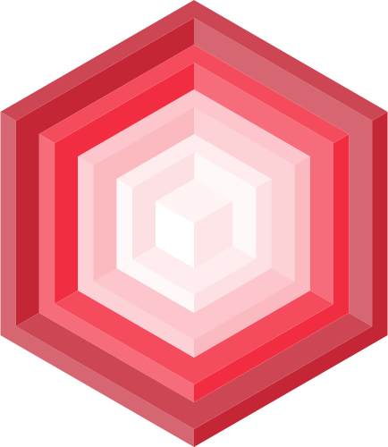
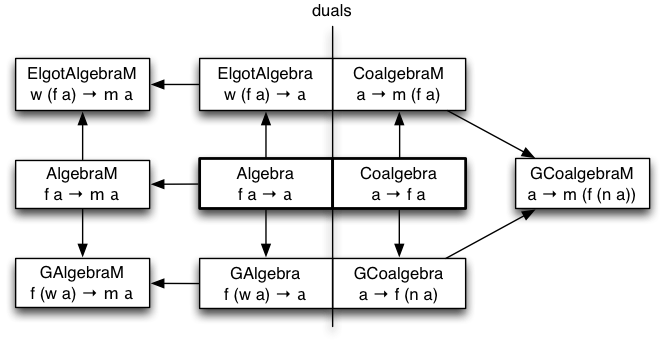
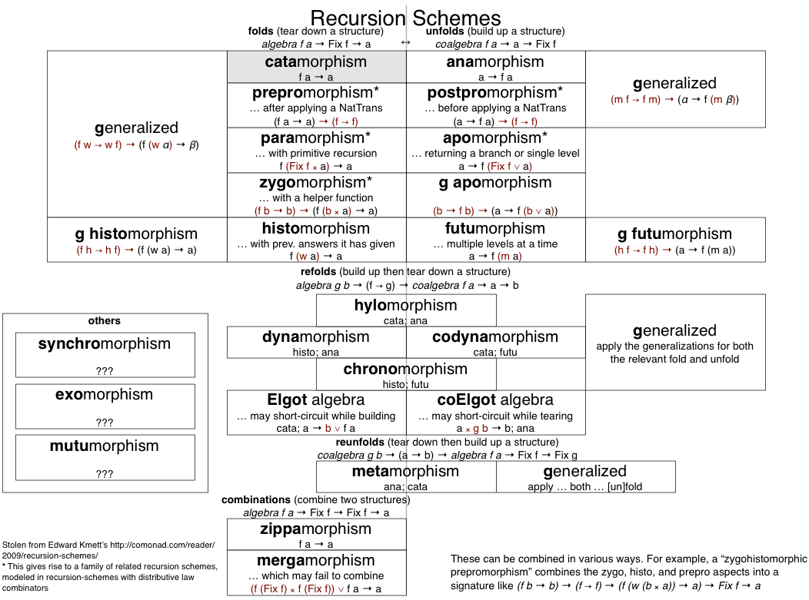

# Matryoshka

Generalized folds, unfolds, and traversals for fixed point data structures in Scala.

[](https://travis-ci.org/slamdata/matryoshka)
[](https://codecov.io/github/slamdata/matryoshka?branch=master)
[](https://gitter.im/slamdata/matryoshka?utm_source=badge&utm_medium=badge&utm_campaign=pr-badge&utm_content=badge)
[](https://index.scala-lang.org/slamdata/matryoshka)

## External Resources

- [Functional Programming with Bananas, Lenses, Envelopes and Barbed Wire](http://citeseerx.ist.psu.edu/viewdoc/summary?doi=10.1.1.41.125) – the iconic paper that collected a lot of this info for the first time
- [Recursion Schemes: A Field Guide (Redux)](http://comonad.com/reader/2009/recursion-schemes/) – Ed Kmett’s summary of various folds and unfolds, with links to Haskell code
- [Unifying Structured Recursion Schemes](http://www.cs.ox.ac.uk/people/jeremy.gibbons/publications/urs.pdf) – a newer paper on how to generalize recursion schemes
- [Efficient Nanopass Compilers using Cats and Matryoshka](https://github.com/sellout/recursion-scheme-talk/blob/master/nanopass-compiler-talk.org) – Greg Pfeil’s talk on this library (and some other things)
- [Fix Haskell (by eliminating recursion)](https://github.com/sellout/recursion-scheme-talk/blob/master/recursion-scheme-talk.org) – Greg Pfeil’s talk on recursion schemes in Haskell
- Recursion schemes by example - Tim Williams [slides](https://github.com/willtim/recursion-schemes/raw/master/slides-final.pdf) [talk](https://www.youtube.com/watch?v=Zw9KeP3OzpU)
- [Practical Recursion Schemes](https://jtobin.io/practical-recursion-schemes) - Jared Tobin
- [Promorphisms, Pre and Post](https://jtobin.io/promorphisms-pre-post) - Jared Tobin
- [Time Traveling Recursion Schemes](https://jtobin.io/time-traveling-recursion) - Jared Tobin
- [Automatic Differentiation via recursion schemes](https://jtobin.io/ad-via-recursion-schemes) - Jared Tobin

## Usage

1. Add a dependency
 ```scala
libraryDependencies += "com.slamdata" %% "matryoshka-core" % "0.18.3"
```
Optionally, you can also depend on `matryoshka-scalacheck` to get `Arbitrary`/`Cogen`/`Shrink` instances for a bunch of pattern functors and fixed points.

2. Apply some fix for SI-2712. Prior to 2.12, use @milessabin’s [compiler plugin](https://github.com/milessabin/si2712fix-plugin). As of 2.12, you can simply add `scalacOptions += "-Ypartial-unification"` to your build.sbt.

3. Add imports as needed. Usually the following should suffice
```scala
import matryoshka._
import matryoshka.implicits._
```
but if you need some of our pattern functors, then `matryoshka.patterns._` should be added. Also, there will be cases where you need to specify explicit types (although we generally recommend abstracting over `{Bir|Cor|R}ecursive` type classes), so you may need `matryoshka.data._` (for `Fix`, `Mu`, and `Nu`) and/or `matryoshka.instances.fixedpoint._` for things like `Nat`, `List`, `Cofree`, etc. defined in terms of `Mu`/`Nu`.

## Introduction

This library is predicated on the idea of rewriting your recursive data structures, replacing the recursive type reference with a fresh type parameter.

```scala
sealed abstract class Expr
final case class Num(value: Long)      extends Expr
final case class Mul(l: Expr, r: Expr) extends Expr
```

could be rewritten as

```scala
sealed abstract class Expr[A]
final case class Num[A](value: Long) extends Expr[A]
final case class Mul[A](l: A, r: A)  extends Expr[A]
```

This abstract class generally allows a `Traverse` instance (or at least a `Functor` instance). Then you use one of the fixed point type constructors below to regain your recursive type.

You may also want instances for `Delay[Equal, ?]`, `Delay[Order, ?]`, and `Delay[Show, ?]` (which are very similar to their non-`Delay` equivalents) to get instances for fixed points of your functor.

### Fixpoint Types

These types take a one-arg type constructor and provide a recursive form of it.

All of these types have instances for `Recursive`, `Corecursive`, `FunctorT`, `TraverseT`, `Equal`, `Show`, and `Arbitrary` type classes unless otherwise noted.

- `Fix` – This is the simplest fixpoint type, implemented with general recursion.
- `Mu` – This is for inductive (finite) recursive structures, models the concept of “data”, aka, the “least fixed point”.
- `Nu` – This is for coinductive (potentially infinite) recursive structures, models the concept of “codata”, aka, the “greatest fixed point”.
- `Cofree[?[_], A]` – Only has a `Corecursive` instance if there’s a `Monoid` for `A`. This represents a structure with some metadata attached to each node. In addition to the usual operations, it can also be folded using an Elgot algebra.
- `Free[?[_], A]` – Does not have a `Recursive` instance. In addition to the usual operations, it can also be created by unfolding with an Elgot coalgebra.

So a type like `Mu[Expr]` is now isomorphic to the original recursive type. However, the point is to avoid operating on recursive types directly …

### Algebras

A structure like this makes it possible to separate recursion from your operations. You can now write transformations that operate on only a single node of your structure at a time.



This diagram covers the major classes of transformations. The most basic ones are in the center and the arrows show how they can be generalized in various ways.

Here is a very simple example of an algebra (`eval`) and how to apply it to a recursive structure.

```scala
// we will need a Functor[Expr] in order to call embed bellow
implicit val exprFunctor = new scalaz.Functor[Expr] {
  override def map[A, B](fa: Expr[A])(f: (A) => B) = fa match{
    case Num(value) => Num[B](value)
    case Mul(l, r) => Mul(f(l), f(r))
  }
}

val eval: Algebra[Expr, Long] = { // i.e. Expr[Long] => Long
  case Num(x)    => x
  case Mul(x, y) => x * y
}
 
def someExpr[T](implicit T: Corecursive.Aux[T, Expr]): T =
  Mul(Num[T](2).embed, Mul(Num[T](3).embed,
      Num[T](4).embed).embed).embed

import matryoshka.data.Mu 

someExpr[Mu[Expr]].cata(eval) // ⇒ 24
```

The `.embed` calls in `someExpr` wrap the nodes in the fixed point type. `embed` is generic, and we abstract `someExpr` over the fixed point type (only requiring that it has an instance of `Corecursive`), so we can postpone the choice of the fixed point as long as possible.

The [example directory](tests/shared/src/test/scala/matryoshka/example) will show you how to use other algebras and recursion schemes.
 
### Recursion Schemes

Here is a cheat-sheet (also available [in PDF](resources/recursion-schemes.pdf)) for some of them.



#### Folds

Those algebras can be applied recursively to your structures using many different folds. `cata` in the example above is the simplest fold. It traverses the structure bottom-up, applying the algebra to each node. That is the general behavior of a fold, but more complex ones allow for various comonads and monads to affect the result.

#### Unfolds

These are the dual of folds – using coalgebras to deconstruct values into parts, top-down. They are defined in the `Corecursive` type class.

#### Refolds

Refolds compose an unfold with a fold, never actually constructing the intermediate fixed-point structure. Therefore, they are available on any value, and are not part of a type class.

#### Transformations

The structure of these type classes is similar to `Recursive` and `Corecursive`, but rather than separating them between bottom-up and top-down traversals, `FunctorT` has both bottom-up and top-down traversals (and refold), while `TraverseT` has all the Kleisli variants (paralleling how `Traverse` extends `Functor`). A fixed-point type that has both `Recursive` and `Corecursive` instances has an implied `TraverseT` instance.

The benefits of these classes is that it is possible to define the required `map` and `traverse` operations on fixed-point types that lack either a `project` or an `embed` (e.g., `Cofree[?[_], A]` lacks `embed` unless `A` has a `Monoid` instance, but can easily be `map`ped over).

The tradeoff is that these operations can only transform between one fixed-point functor and another (or, in some cases, need to maintain the same functor).

The names of these operations are the same as those in `Recursive` and `Corecursive`, but prefixed with `trans`.

There is an additional (restricted) set of operations that also have a `T` suffix (e.g., `transCataT`). These only generalize in “the Elgot position” and require you to maintain the same functor. However, it can be the most natural way to write certain transformations, like `matryoshka.algebras.substitute`.

### Generalization

There are generalized forms of most recursion schemes. From the basic `cata` (and its dual, `ana`), we can generalize in a few ways. We name them using either a prefix or suffix, depending on how they’re generalized.

#### G…

Most well known (in fact, even referred to as “generalized recursion schemes”) is generalizing over a `Comonad` (or `Monad`), converting an algebra like `F[A] => A` to `F[W[A]] => A`. Many of the other named folds are instances of this –

- when `W[A] = (T[F], A)`, it’s `para`,
- when `W[A] = (B, A)`, it’s `zygo`, and
- when `W[A] = Cofree[F, A]`, it’s `histo`.

These specializations can give rise to other generalizations. `zygoT` uses `EnvT[B, ?[_], A]` and `ghisto` uses `Cofree[?[_], A]`.

#### …M

Less unique to recursion schemes, there are Kleisli variants that return the result in any monad.

#### Elgot…

This generalization, stolen from the “Elgot algebra”, is similar to standard generalization, except it uses `W[F[A]] => A` rather than `F[W[A]] => A`, with the `Comonad` outside the functor. Not all of the forms seem to be as useful as the `G` variants, but in some cases, like `elgotZygo`, it offers benefits of its own.

#### GElgot…M

Any of these generalizations can be combined, so you can have an algebra that is generalized along two or three dimensions. A fold like `cofPara` takes an algebra that’s generalized like `zygo` (`(B, ?)`) in the “Elgot” dimension and like `para` (`(T[F], ?)`) in the “G” dimension, which looks like `(B, F[(T[F], A)]) => A`. It’s honestly useful. I swear.

### Implementation

Since we can actually derive almost everything from a fairly small number of operations, why don’t we? Well, there are a few reasons, enumerated here in descending order of how valid I think they are:

1. Reducing constraints. In the case of `para`, using `gcata(distPara, …)` would introduce a `Corecursive` constraint, and all of the Kleisli variants require `Traverse` for the functor, not just `Functor`.
2. Improving performance. `cata` implemented directly (presumably) performs better than `gcata[Id, …]`. We should have some benchmarks added eventually to actually determine when this is worth doing.
3. Helping inference. While we are (planning to) use kinda-curried type parameters to help with this, it’s still the case that `gcata` generally requires all the type parameters to be specified, while, say, `zygo` doesn’t. You can notice these instances because their definition actually is just to call the generalized version, rather than being implemented directly.

## Contributing

Please note that this project is released with a [Contributor Code of Conduct](CODE_OF_CONDUCT.md). By participating in this project you agree to abide by its terms.

## Users

- [Quasar](https://github.com/quasar-analytics/quasar)
